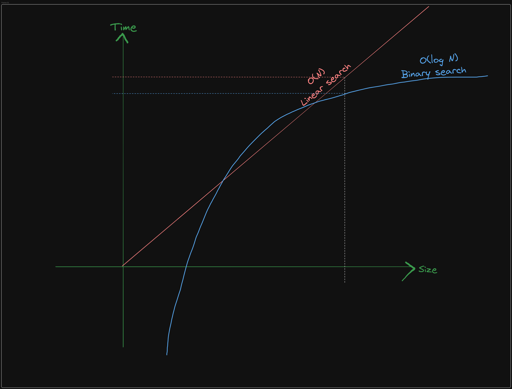
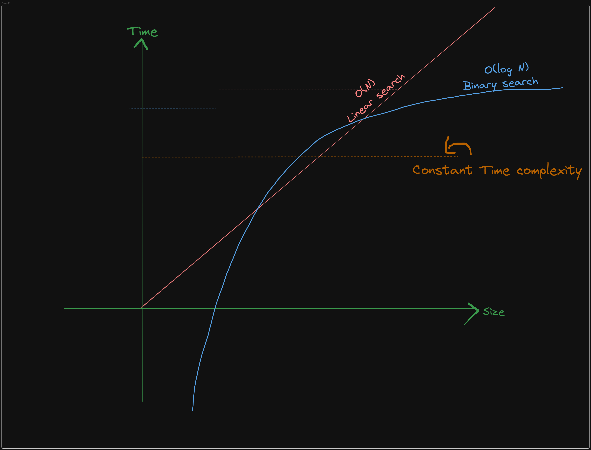
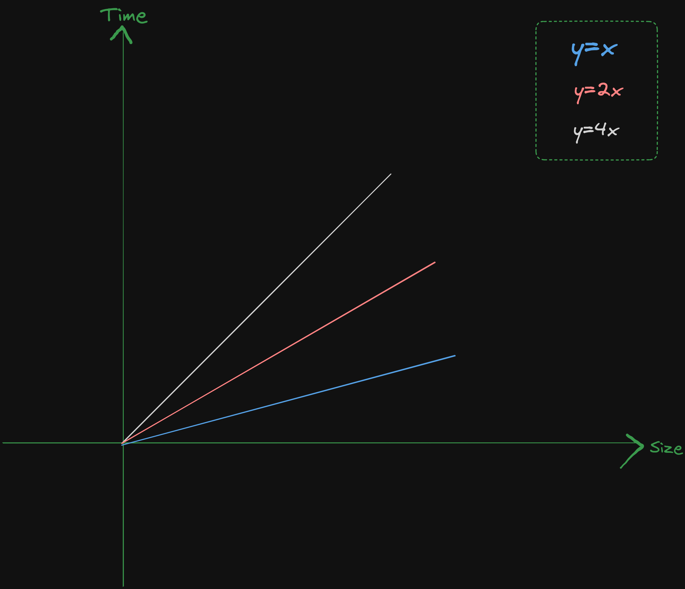

# The Time and Space Complexity !!!

## 1) What is Time Complexity?

Consider an old computer and a latest macbook pro.

Both has 1M elements in an array.

Let's say, we apply linear search on both the computers with a target as an element that doens't exist in the array.

Assuming, the old computer takes 10 seconds to search and the latest macbook pro takes 1 second to search.

**Which of the two computers has more time complexity?**

Ans: Both the computers have the same time complexity.

The conclusion that we get from this is, time complexity is not equal to time taken.
`time_complexity != time_taken`

So, what is time complexity?

Reconsider the example of old machine and macbook pro.

Let's say, I create a graph with time taken on y-axis and number of elements on x-axis.

The graph for old machine will be a straight line and the graph for macbook pro will be a straight line.

But, the graph of old machine will be steeper than the graph of macbook pro.

This graph is called time complexity graph.

**Time Complexity** is the mathematical function that tells us how the time is going to grow as the input grows.

### 2) Why do we need to study Time Complexity?

Let's say for a linear search and binary search, the graph looks like this:



- For same larger size, the one whose complexity is O(log N) is taking less time than that of the one which has the complexity as O(N).


Constant Time complexity means, the time taken doesn't change with the size parameter.



`O(1) < O(log N) < O(N)`

### 3) What do we consider when thinking about complexity?

1. Always look for the worst case complexity.
2. Always look at complexity for large/infinite data.

3. 
   
   
   i. Even though, the values of actual time are different, they are all growing linearly only
   
   ii. We don't care about the actual time taken as it can vary from machine to machine, we care about how the time grows with the input size.
   
   So, this is why we don't need to conisider the constants in the time complexity.

4. Consider: `O(N^3 + log N)` - Always ignore less dominating terms.
   1. From point(2), consider 1 million data, it will take 1 million^3 + log(1 million) operations.
   2. Totally, assume it takes 1 million^3 seconds and 6 seconds.
   3. Here, the 6 seconds is negligible when compared to 1 million^3 seconds.
   4. So, we can ignore the log N

O(1) < O(log N) < O(N) < O(N log N) < O(2^N)

### 4) What is Big-Oh Notation?

- Word Definition:
  - Let's say a function has O(N^3).
  - In simple language, this is the upper bound, the graph cannot exceed N^3.

- Mathematical Definition:
  - Consider, `f(N) = O(g(N))`
  - It means, 
  $$\lim_{{N \to \infty}} \left(\frac{{f(N)}}{{g(N)}}\right) < \infty$$
  - Now consider, `f(N) = O(6N^3 + 3N + 5)`, `g(N) = N^3`
  - Now, the limit expression will be,
  - $$\lim_{{N \to \infty}} \left(\frac{{6N^3 + 3N + 5}}{{N^3}}\right)$$
  - Solving it by dividing N^3 to all the terms in the numerator, the expression will be,
  - $$\lim_{{N \to \infty}} \left(\frac{{6 + 3/N^2 + 5/N^3}}{{1}}\right)$$
  - After applying the limit, the expression will be,
  - $$\left({{6 + 0 + 0}}\right) => 6 < \infty$$

### 5) What is Big-Omega Notation?

- It is opposite to Big-Oh Notation.
- Word Definition:
  - When you say a function has Omega(N^3), it means, the function takes atleast N^3 time complexity.
  - It is lower bound.
  - The graph cannot go below N^3.
- Mathematical Definition:
  - Consider, `f(N) = Omega(g(N))`
  - It means,
  $$\lim_{{N \to \infty}} \left(\frac{{f(N)}}{{g(N)}}\right) > 0$$


### 6) Qn - What if an algorithm has both Big-Oh and Big-Omega as N^2?

- $O(N^2)$ && $\omega(N^2)$
- It means, the function has both upper and lower bound as N^2.
- This is what we call as Theta Notation.
- $\theta(N^2)$ can be written as,
  - $$0 < \lim_{{N \to \infty}} \left(\frac{{f(N)}}{{g(N)}}\right) < \infty$$
- Both upper and lower bounds are same.
- Since, we consider the worst case, we consider the upper bound which is Big-Oh notation.

### 7) Little-Oh Notation

- Word Definition:
   - This is also an upper bound.
   - But, this is not strict upper bound.
   - It is a loose upper bound.
   - If I say, `f=O(g)`, it means, `f` can grow at most as fast as `g`.
     - `f <= g`
   - If I say, `f=o(g)`, it means, `f` grows strictly slower than `g`.
     - `f < g`
- Mathematical Definition:
   - Consider, `f(N) = o(g(N))`
   - It means,
   $$\lim_{{N \to \infty}} \left(\frac{{f(N)}}{{g(N)}}\right) = 0$$

### 8) Little-Omega Notation

- Word Definition:
   - This is also a lower bound.
   - But, this is not strict lower bound.
   - It is a loose lower bound.
   - If I say, `f=Omega(g)`, it means, `f` can grow at least as fast as `g`.
     - `f >= g`
   - If I say, `f=omega(g)`, it means, `f` grows strictly faster than `g`.
     - `f > g`
- Mathematical Definition:
   - Consider, `f(N) = omega(g(N))`
   - It means,
   $$\lim_{{N \to \infty}} \left(\frac{{f(N)}}{{g(N)}}\right) = \infty$$

### 9) Space Complexity

- It is the sum of input space and auxiliary space.
- Input space is the space required to store the input.
- Auxiliary space is the space used by the algorithm.
- Binary search has constant(O(1)) space complexity.

### 10) Qn - What is the time complexity of the below pseudo code?

```java
for(i=1;i<=N;){
  for(j=1;j<=k;j++) {
    // some operation that takes time 't'
  }
  i = i + k;
}
```

- Outer loop doesn't run N times, as i is not incremented by 1 but by k.
- Let's first consider the inner loop.
- Inner loop runs k times.
- For every loop, it takes time 't'.
- Total time taken by inner loop is k*t.
- Ans: O(kt * times outer loop runs)
- First, the value of i is 1.
- Next, the value of i is k+1, then the value of i is 2k+1, then the value of i is 3k+1, and so on until some `1+xk`.
- `1+xk` should be less than or equal to N.
- `x` is the number of times it is running.
- `1+xk` <= N
- `xk` <= N - 1
- `x` <= (N-1)/k
- `x` is the number of times the outer loop is running.
- Complexity: O(kt * (N-1)/k)
- `k` gets cancelled, Ans: O(t(N-1))
- We can ignore the constants, Final Ans: O(N*t)


### Recursive Algorithms

**At any particular point of time, no two function call at the same level of recursion will be in the stack at the same time.**

- Trick: Only calls that are interlinked with each other will be in the stack at the same time. Because, the previous call will be waiting for the next call to complete and so on.

- Maximum number of calls in the stack at any point of time is the maximum depth of the recursion tree which is the height of the recursion tree.

- For Fibonacci of N, the height of the recursion tree is N.
- Space Complexity: O(N) 

### Types of Recurrence Relations

1. Linear Recurrence Relation
    - F(N) = F(N-1) + F(N-2) // Fibonacci
2. Divide and Conquer Recurrence Relation
    - F(N) = F(N/2) + O(1) // Binary Search

#### Divide and Conquer Recurrence Relation
- Form:
   $$T(N) = a_1T(b_1x+{\sum}_1(x)) + a_2T(b_2x+{\sum}_2(x)) + ... + a_kT(b_kx+{\sum}_k(x)) + g(x)$$
   where, $x >= x_0$ (some constant).

- Consider binary search:
   $$T(N) = T(\frac{N}{2}) + C$$
   - Here, $a_1 = 1$, $b_1 = 1/2$, ${\sum}_1(x) = 0$, $g(x) = C$

- Consider this recurrence relation:
   $$T(N) = 2T(\frac{N}{2}) +(N-1)$$ 
   - This relation is saying, do something with half of the array, then do something with other half of the array as it is: $2T(\frac{N}{2})=T(\frac{N}{2})+T(\frac{N}{2})$
   - $g(N)$ is basically, when you get answer from this recursion call from the 1st expression + what you are doing with that answer - takes how much time
   - An example would be merge sort.
   - Given an array, you'll sort first half of the array(T(N/2)), then you'll sort the second half of the array(T(N/2)). When both are done, you'll merge those arrays(N-1 comparisons).
   - $g(N)$ simply says, once the recursion calls are over, what time it will take to actually use that results and make something
   - In binary search, we'll just compare if the number is greater or smaller or equal to the mid element that takes only constant time.

### How to actually solve to get complexity?

1. Plug & Chug - taught in B.Tech
2. Master Theorem - taught in B.Tech
3. Akra-Bazzi Formula - The Best method

### Akra-Bazzi Formula

$$T(x) = \theta(x^p+x^p\int_{1}^{x} \frac{g(u)}{u^{p+1}} du)$$

What is p?

$$a_1b_1^p + a_2b_2^p + ... + a_kb_k^p = 1$$

$$\sum_{i=1}^{k} a_ib_i^p = 1$$

Let's take an example of merge sort:

$$T(N) = 2T(\frac{N}{2}) + N-1$$

Here, $a_1 = 2$, $b_1 = 1/2$, $p = 1$, $g(x) = x-1$

$$2(\frac{1}{2})^p + 0 = 1$$

By solving, $p = 1$

Substitute the values in the Akra-Bazzi formula to get the time complexity.

$$T(x) = \theta(x^1+x^1\int_{1}^{x} \frac{u-1}{u^{2}} du)$$

Solving the integration part,

$$T(x) = \theta(x^1+x^1(\int_{1}^{x} \frac{u}{u^{2}} du - \int_{1}^{x} \frac{1}{u^{2}} du))$$

$$T(x) = \theta(x^1+x^1(\int_{1}^{x} \frac{1}{u} du - \int_{1}^{x} \frac{1}{u^{2}} du))$$

$$T(x) = \theta(x^1+x^1(\log x - \frac{1}{x} - 1))$$

$$T(x) = \theta(x+x\log x - 1 - x)$$

$$T(x) = \theta(x\log x + 1)$$

Ignoring the constants, the time complexity is $\theta(x\log x)$ which is the time complexity of merge sort.

For an array of size `N`, the time complexity of merge sort is $\theta(N\log N)$.


### Qn: Find time complexity of this recurrence relation?

$$T(N) = 2T(\frac{N}{2}) + \frac{8}{9} T(\frac{3N}{4}) + N^2$$

1. Findings $p$:
  
$a_1=2$, $b_1=1/2$, $a_2=8/9$, $b_2=3/4$

$$2(\frac{1}{2})^p + \frac{8}{9}(\frac{3}{4})^p = 1$$

For, $p=1$, the equation is not satisfied.
For, $p=2$, the equation is satisfied.

2. Substitute the values in the Akra-Bazzi formula to get the time complexity.

$$T(x) = \theta(x^2+x^2\int_{1}^{x} \frac{u^2}{u^{3}} du)$$

$$T(x) = \theta(x^2+x^2\int_{1}^{x} \frac{du}{u})$$

$$T(x) = \theta(x^2+x^2\log x)$$

Ignoring less dominating terms, the time complexity is $\theta(x^2\log x)$.


### When you can't find the value of p?

Consider,
$$T(x) = 3T(\frac{x}{3}) + 4T(\frac{x}{4}) + x^2$$

let's say, $p=1$

$$3(\frac{1}{3})^1 + 4(\frac{1}{4})^1 = 1$$

We get LHS as 2 > 1 => Increase the denominator. To do that, increase the value of power.

Hence, p>1.

Now, let's say, $p=2$

$$3(\frac{1}{3})^2 + 4(\frac{1}{4})^2 = 1$$

We get LHS as $\frac{7}{12} < 1$ => You need to increase the value of 2nd expression, to do that, you decrease the value of denominator which can be done by reducing the value of power.

Hence, p<2.

So, the value of p is between 1 and 2.

NOTE: When $p<powerof g(x)$, then ans = $g(x)$

Here, power of g(x) is 2, p is between 1 and 2, hence the answer is $O(x^2)$.


### Solving linear recurrences:

Ex: F(N) = F(N-1) + F(N-2)

**Form:**
  $$f(x) = a_1f(x-1) + a_2f(x-2) + a_3f(x-3)+... + a_nf(x-n)$$

  Can be written as:

  $$f(x) = \sum_{i=1}^{n} a_if(x-i)$$ 
  for $a_i$, $n$ is fixed.
  where,
  - $n$ is order of the recurrence.


### Solution for fibonacci no:

$$f(N) = f(N-1) + f(N-2) $$

Steps:

1. Put $f(N)=\alpha^n$ for some constant $\alpha$
   - Equation becomes:
      $$\alpha^n = \alpha^{n-1} + \alpha^{n-2}$$
   - Rearranging the equation:
      $$\alpha^n - \alpha^{n-1} - \alpha^{n-2} = 0$$
   - Dividing the equation by $\alpha^{n-2}$:
      $$\alpha^2 - \alpha - 1 = 0$$
   - This is a quadratic equation.
   - Solving the equation by quadratic formula:
      $$\alpha = \frac{1 \pm \sqrt{5}}{2}$$
   - The roots are $\frac{1 + \sqrt{5}}{2}$ and $\frac{1 - \sqrt{5}}{2}$.

2. $f(n) = C_1\alpha_1^n + C_2\alpha_2^n$ is also a solution for fibonacci
   - Substitute the values of $\alpha_1$ and $\alpha_2$ in the equation.
   - $f(n) = C_1(\frac{1 + \sqrt{5}}{2})^n + C_2(\frac{1 - \sqrt{5}}{2})^n$

3. Fact: No. of roots = No. of answers you have already.
   - Here, we have 2 roots, hence we have 2 answers.
   - $\therefore f(0)=0$ & $f(1)=1$
   - $f(0) = 0 = C1 + C2 => C1 = -C2$
   - $f(1) = 1 = C_1(\frac{1 + \sqrt{5}}{2}) + C_2(\frac{1 - \sqrt{5}}{2})$
   - Since, $C1 = -C2$, the equation becomes:
     $$1 = C_1(\frac{1 + \sqrt{5}}{2}) - C_1(\frac{1 - \sqrt{5}}{2})$$
    - Solving the equation, we get:
      $$C_1 = \frac{1}{\sqrt{5}}$$
      $$C_2 = -\frac{1}{\sqrt{5}}$$
    - Substitute the values of $C_1$ and $C_2$ in the equation to get the final answer.
    $$f(n) = \frac{1}{\sqrt{5}}(\frac{1 + \sqrt{5}}{2})^n - \frac{1}{\sqrt{5}}(\frac{1 - \sqrt{5}}{2})^n$$
    - This is the formula for fibonacci number🚀, How cool is that!!?
  
4. Getting time complexity from this,
    - You can rewrite the equation by taking common terms.
    $$f(n) = \frac{1}{\sqrt{5}}[(\frac{1 + \sqrt{5}}{2})^n - (\frac{1 - \sqrt{5}}{2})^n]$$
    - The second term on calculating, will be less than 1. While n becomes large and gets closer to infinity, the second term will become negligible.
    - Ignoring less dominating term, and constants.
    - Complexity: $T(N)=O(\frac{1 + \sqrt{5}}{2})^N$
    - Also written as, $T(N)=O(1.618)^N$
    - 1.618 is called as Golden Ratio.


### If the roots are equal:

Consider the equation, $f(N) = 2f(N-1) - f(N-2)$

1. Put $f(N)=\alpha^n$ for some constant $\alpha$
   - Equation becomes:
      $$\alpha^n = 2\alpha^{n-1} - \alpha^{n-2}$$
   - Dividing the equation by $\alpha^{n-2}$:
      $$\alpha^2 = 2\alpha - 1$$
   - This is a quadratic equation.
   - Solving the equation by quadratic formula:
      $$\alpha = 1, 1$$

- **General Case:** If $\alpha$ is repeated r times, then 
   $$\alpha^n, n\alpha^n, n^2\alpha^n,...,n^r\alpha^n$$
   are all solutions to the recurrence.

   Hence, I take two roots,
   - $1, n\alpha^n$
   - $f(n) = C_1(\alpha)^n + C_2(n\alpha^n)$
   - Since we have 2 roots, we have 2 answers.
   - $\therefore f(0)=0$ & $f(1)=1$
   - $f(0) = 0 = C1$
   - $f(1) = 1 = C_1 + C_2$
   - $C_1 = 0$, $C_2 = 1$
   - Substitute the values of $C_1$ and $C_2$ in the equation to get the final answer.
   - $f(n) = n$
   - Time Complexity: $O(N)$

**Homogenous Equation:** The equation won't have other functions like we had $g(x)$

### Non-Homogenous linear recurrences:

$$f(n) = a_1f(n-1) + a_2f(n-2) + ... + a_df(n-d) + g(n)$$

Here, $g(n)$ is a function that makes the equation non-homogenous.

How to solve this?

1. Put $g(n) = 0$ and solve the equation usually.
2. Take $g(n)$ to one side and find particular solution
3. Guess something that is similar to g(n)
4. Add the particular solution to the general solution of the homogenous equation.


How to guess the particular solution?

1. If $g(n)$ is exponential, then guess of same type
   1. Ex: $g(n) = 2^n+3^n$, then guess $f(n) = A2^n+B3^n$
2. If $g(n)$ is polynomial, then guess of same degree
   1. Ex: $g(n) = n^2-1$ => guess of same degree 2 --> $f(n) = An^2+Bn+C$
3. If it is both, then guess of both
   1. Ex: $g(n) = 2^n+n$ => guess $f(n) = A2^n+Bn+C$
4. If in exponential, if the guess fails, increase the degree by one and try again.
   1. Consider the first guess as $f(n) = a2^n$, then next guess as $f(n) = (an+b)2^n$, If that also fails, increase the degree
   2. It will be $f(n) = (an^2+bn+c)2^n$


Ex: $f(n) = 2f(n-1) + 2^n$ ; $f(0) = 1$

1. Put $2^n = 0$
   - $f(n) = 2f(n-1)$
   - Put $f(n) = \alpha^n$
   - Equation becomes:
      $$\alpha^n - 2\alpha^{n-1} = 0$$
   - Dividing the equation by $\alpha^{n-1}$:
   - $\alpha - 2 = 0$ => $\alpha = 2$

2. Guess Particular solution:
   - $g(n) = 2^n$
   - Guess $f(n) = A2^n$
   - Now, substitute the values in the equation to get the value of A.
   - $A2^n = 2A2^{n-1} + 2^n$
   - Divide the equation by $2^n$:
   - Equation becomes:
     $A = A + 1$ => This is Wrong
   - Increase the degree of the guess:
   - Guess $f(n) = (An+B)2^n$
   - Now, substitute the values in the equation to get the values of A and B.
   - $(An+B)2^n = 2(An+B)2^{n-1} + 2^n$
   - Divide the equation by $2^n$:
   - Equation becomes:
     $An+B = An - A + B + 1$ => $A = 1$
   - Discard the B term as it is getting cancelled.
   - Substitute the values of A and B in the equation to get the final answer.
   - $f(n) = n2^n$

3. General Answer:
   - $f(n) = C_12^n + n2^n$
   - $f(0) = 1 = C_1$
   - $f(n) = 2^n + n2^n$

Complexity: $O(n2^n)$